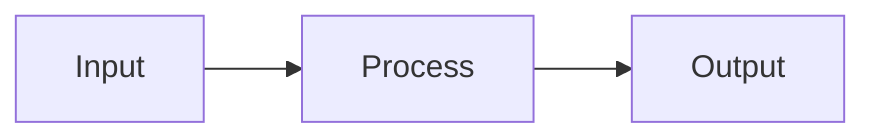

# /canvas-gen — Visual Knowledge Maps

Generate visual process diagrams, knowledge maps, and canvas views from natural language descriptions.

## Trigger
User runs `/canvas-gen [topic]` or asks to create a visual map/canvas/diagram.

## Process

1. **Parse request** — understand what the user wants to visualize:
   - Process flow (steps in sequence)
   - Knowledge map (concepts and relationships)
   - Architecture diagram (system components)
   - Decision tree (branching logic)
   - Comparison matrix (options side by side)

2. **Generate canvas** using JSON Canvas format (compatible with Obsidian/MyMind):

```json
{
  "nodes": [
    {
      "id": "node-1",
      "type": "text",
      "x": 0,
      "y": 0,
      "width": 250,
      "height": 60,
      "text": "Step/Concept Title"
    }
  ],
  "edges": [
    {
      "id": "edge-1",
      "fromNode": "node-1",
      "toNode": "node-2",
      "label": "relationship"
    }
  ]
}
```

3. **Also generate Mermaid diagram** as fallback for non-canvas environments:



4. **EEVL-specific templates** available:
   - **Media Production Pipeline** — Shoot → Edit → Deliver flow
   - **Content Pipeline** — Idea → Create → Design → Distribute
   - **Client Journey** — Lead → Sale → Onboard → Deliver → Retain
   - **M3TA OS Architecture** — Full system map
   - **Revenue Flow** — Lead → Invoice → Payment → Books

5. **Save** to vault:
   - Canvas file → `03-media/` or relevant project folder
   - Mermaid backup → embedded in a markdown note alongside

## Output
- Canvas file created and saved
- Mermaid diagram displayed in terminal
- File path shown for opening in Obsidian/MyMind
